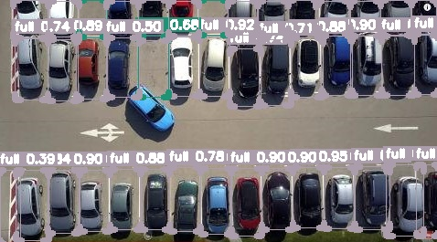

# YOLO-NAS-OnnxRuntime

<p>
    <a href="#"></a>
    <a href="#"></a>
    <a href="#"></a>
    <a href="#"></a>
    <a href="#"></a>
    <a href="#"></a>
    <a href="#"></a>
</p>

This repo provides the C++ implementation of YOLO-NAS based on ONNXRuntime for performing object detection in real-time.


# ➤ Contents
1) [Dependecies](#Dependecies)

2) [Build](#Build)

3) [Examples](#Examples)

4) [Demo](#Demo)

5) [References](#References)

6) [License](#License)

<p>
    
    
    
</p>


<h1 id="Requirements">➤ Dependecies</h1>

* **Python Install :**

    Quick installation from SuperGradients package

    ```
      pip install super_gradients==3.1.1
    ```

* **C++ Install :**
  - OpenCV 4.x
  - ONNXRuntime 1.10+
  - OS: Tested on Ubuntu 20.04 and Apple Silicon (M1)
  - CUDA 11+ [Optional]

<h1 id="Build">➤ Build</h1>

Rapidly build the project you can run the following commands:
```bash
# You can change ONNXRUNTIME_VERSION="x.x.x" in line 4.

./build.sh
```

If you want to use your own onnxruntime version, decompress the tgz library of onnxruntime :

onnxruntime repo: https://github.com/microsoft/onnxruntime/tags

```bash
tar zxvf onnxruntime-linux-x64-gpu-1.10.0.tgz
```

Next, don't forget to change `ONNXRUNTIME_DIR` cmake option:

```bash
mkdir build && cd build
cmake .. -D ONNXRUNTIME_DIR=path_to_onnxruntime -DCMAKE_BUILD_TYPE=Release
cmake --build .
```

<h1 id="Examples">➤ Examples</h1>

 * ***Comvert Pytorch to ONNX model*** :

    ```
    # default coco model
    python3 convertPytorchToONNX.py --input_model yolo_nas_s --output_dir ./models --img-size 640 640 

    # your custom model
    python3 convertPytorchToONNX.py --input_model yolo_nas_s --output_dir ./models --img-size 640 640 --checkpoint_path <path-to-pth-model> --class_names <path-to-names-file>
    ```
    
    Description of all arguments:
    - `--input_model` : Type contains { `yolo_nas_s` /  `yolo_nas_m` / `yolo_nas_l` }

    - `--img-size` : Set model input size (h, w)

    - `--output_dir` : Directory for saving files, none means using the same path as the input model
    
    - `--checkpoint_path` : The path with save the trained pth model

    - `--class_names` : The path to class names file

    <br>
    YOLO-NAS ~0.5 mAP by official information:

      | Model            | mAP   | Latency (ms) |
      |------------------|-------|--------------|
      | YOLO-NAS S       | 47.5  | 3.21         |
      | YOLO-NAS M       | 51.55 | 5.85         |
      | YOLO-NAS L       | 52.22 | 7.87         |
      | YOLO-NAS S INT-8 | 47.03 | 2.36         |
      | YOLO-NAS M INT-8 | 51.0  | 3.78         |
      | YOLO-NAS L INT-8 | 52.1  | 4.78         |


* ***Run webcam source from CLI*** :

  ```bash
  ./demo --model_path ../models/yolo_nas_s.onnx --source 0 --class_names ../models/coco.names --gpu
  ```

* ***Run video source from CLI*** :

  ```bash
  ./demo --model_path ../models/yolo_nas_s.onnx --source ../demo/video.mp4 --class_names ../models/coco.names --gpu
  ```

* ***Run image source from CLI*** :

  ```bash
  ./demo --model_path ../models/yolo_nas_s.onnx --source ../demo/traffic.jpg --class_names ../models/coco.names --gpu
  ```

<h1 id="Demo">➤ Demo</h1>
  <p>
      
  </p>

<h1 id="References">➤ References</h1>

- YOLO-Nas repo: https://github.com/Deci-AI/super-gradients


<h1 id="License">➤ License</h1>

WiFi Analyzer is licensed under the GNU General Public License v3.0 (GPLv3).

**GPLv3 License key requirements** :
* Disclose Source
* License and Copyright Notice
* Same License
* State Changes
